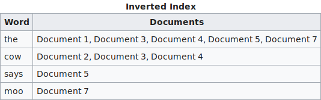
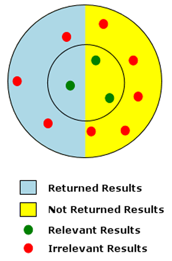
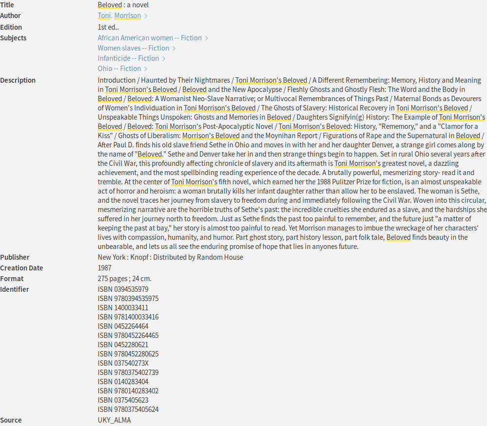
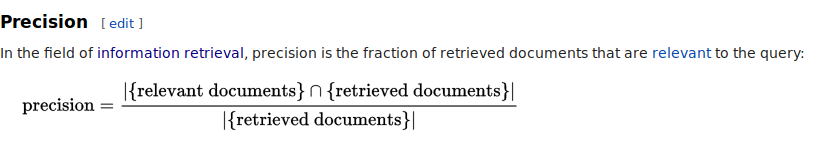
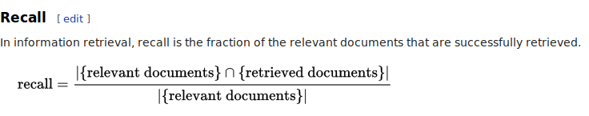
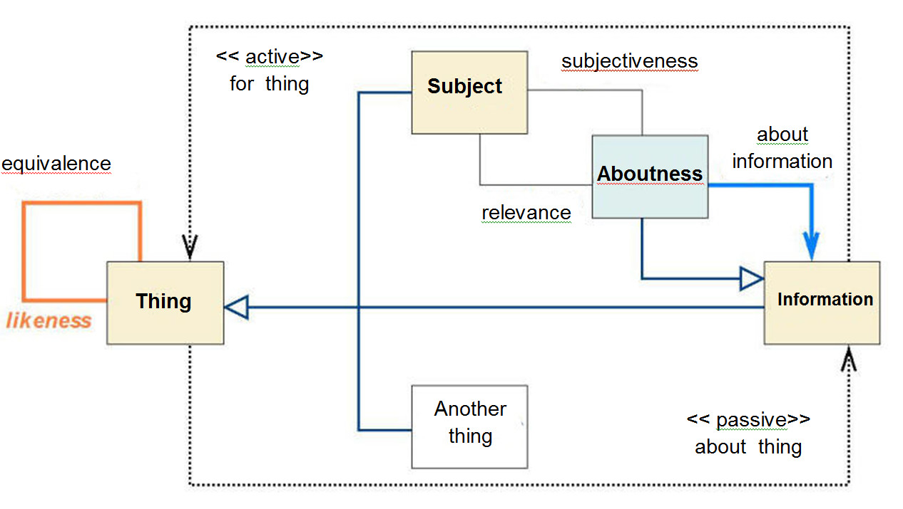
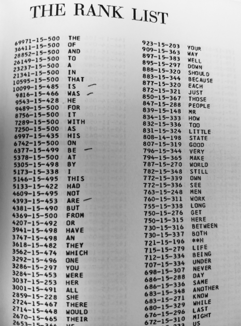

Short Introduction to Information Retrieval
========================================================
author: Sean Burns, PhD
date: 2017-11-14
width: 1600
height: 1100

Information Retrieval Basics
========================================================

- What follows is a brief introduction to information retrieval.
  - The concepts presented here are presented discretely, but in practice there is
  quite a bit of overlap, and other issues are at play that I won't cover here.
- I will also present a couple of toy information retrieval models.
  - This means that I've removed many important details so that we can direct our full attention
  to some basic IR concepts and mechanisms.
- I'll present two kinds of toy information retrieval models:
  - a model based on how full text search works (e.g., a web search engine)
  - a model based on how surrogate record search works (e.g., an online catalog)

The Document
========================================================

## Our theoretical assumption: Everything is a document.

- Text documents
- Audio documents
- Still / moving image documents

***


<small>Source: By undetermined govt dept - The State Archive of Białystok (www.bialystok.ap.gov.pl), Public Domain, https://commons.wikimedia.org/w/index.php?curid=11097308</small>

Information Retrieval Systems
========================================================

## Mirroring their documents

- A system's capabilities mirror the document's composition and structure
- This means that if a system contains text documents, then the retrieval system
  will be designed to match the general characteristics of text documents.
- This is the same with audio files, image files, etc., each of which have their own
  bibliographic characteristics.
  
  ***
  
  Searching text files
  
  
  
  <small>UK InfoKat OPAC</small>
  
  Searching image files
  
  
  
  <small>EBSCOhost Image Collection Search</small>

Information Retrieval Indexes
========================================================

- All search engines and database systems search against an index and not against
  the actual documents or the surrogate records (e.g., bibliographic records).
- For example, Google does not re-search every single web page on the entire internet
  each time someone enters a query in Google; rather, queries are searched against a stored index,
  albeit one that Google is constantly building and modifying based on the
  dynamics of the web and internet and on its own search engineering developments.
  
***



<small>Source: https://en.wikipedia.org/wiki/Search_engine_indexing</small>

Full Text Search: Contents
========================================================

- If we search in a system that indexes the full text, then we 
  search against all the language in that text
- This is useful to know because when we construct queries, it might be helpful
  to imagine how language is used in the documents that build the index
- It also means that we may retrieve documents that do not exactly match our query, 
  because we're not necessarily matching against exact things but against likely things
- Example: web pages and sites, full text databases

***



<small>By SqlPac (talk) - I (SqlPac (talk)) created this work entirely by myself., Public Domain, https://en.wikipedia.org/w/index.php?curid=25837761</small>

Surrogate Records Search: Bibliographic Description
========================================================

- If we search a system that contains document surrogates, or representations of 
  those documents, then we search against pre-set fields of information about the documents.
- We call these pre-set fields surrogate records, and they contain 
  what is called descriptive and access metadata about the documents of interest.
- This is information about the documents and information about how to access
  the documents.
- The pre-set fields are comprised of metadata, or what's shorthand for a document's 
  structure and composition
- Examples: author names, titles, subject headings in an online catalog
- Examples: keywords, abstracts, and more in an Abstract & Index (A&I) database

***



<small>OPAC record in UK InfoKat</small>

Searching Against the Index
========================================================

- The indexes that we search against are built differently depending on whether
  the systems contain full text, surrogate records, or both.
- Indexes of full text systems, like the web, are based on mathematical, statistical, and
  logical rules surrounding various signals in the text. One basic example is
  term frequency, where the frequency of a term in a document indicates
  something *about* the document; that is, its *aboutness*. 
- Indexes of surrogate records, like an A&I system, are more contolled and
  structured simply because the surrogates are fixed and designed. Oftentimes,
  there will also be rules about how the surrogate records are written. Here
  you should think of as examples things like records in an online card catalog
  system, or an OPAC, for online public access catalog
  
***





<small>Source: https://en.wikipedia.org/wiki/Precision_and_recall</small>
  
Toy Model 1: Full Text Search
========================================================

- In our first model, we begin by examining full text search.
- Imagine that we've entered a simple search query into some popular search
  engine using a single term. If it helps, imagine our search term is *librarian*.
- By setting up a toy model (i.e., an oversimplified model), we can start to acquire
  an intuition of how information retrieval works.
- Before we examine the model, one more thing about *aboutness*

***

A librarian we might be interested in learning from or about:


<small>Carla Hayden, Librarian of Congress<br>
Source: https://www.loc.gov/about/about-the-librarian/</small>

Toy Model 1: Aboutness 
========================================================

- It seems obvious that if I search for a term, then I would want results to 
  documents (e.g., web pages, etc.) that contain my term.
- As a result, we might assume that how or how often a term is used in a document
  must say something about what that document is about and the strength of that
  *aboutness*. Therefore, we connect  the idea of *aboutness* of a document to
  the appearance of terms in a document.
- Ex: if we search a system with the term *librarian*, then we likely want to retrieve
  documents that contain that term. For if a document contains the term *librarian*,
  then we might reason that the document is about librarians.
- One consequence, we might assume that if a document has a word count of 500 and
  the term *librarian* appears in that document 10 times, then this document must
  be more *about* librarians than a document with a word count of 500 but where
  the term *librarian* only appears twice.
  
***



<small>Source: Helena Kučerová. (2014). What do we analyze during subject
analysis of documents: The concept of aboutness in knowledge organization.
Revue of Librarianshi, 25*.<br>
http://oldknihovna.nkp.cz/knihovna141_suppl/1401038.htm</small>
  
Toy Model 1: Term Frequency (tf)
========================================================

- Therefore, one way to measure the importance of a term in a document is to measure the 
  frequency of that term in a document
- Let's imagine that the entire web only contains ten documents.
- Let's also imagine that each of these ten documents contains the same word
  counts: 100 words per document.
- Under this scenario, when all documents are of equal length, then the rank order
  of search results is simply a function of the frequency of the search term 
  in each document: i.e., the more a term appears in the document, the higher its rank,
  or its relevance, given our search for the term *librarian*.

***



<small>Source: Kučera, H., & Francis, W. N. (1967). Computational analysis of
present-day American English. Brown University Press: Providence, RI.</small>

Toy Model 1: Searching a Full Text System
========================================================

We can model this. Here we search a system where each document in the system 
contains exactly 100 words but where our term appears more or less or equally as
frequently in each of these documents. Under such an (unlikely) scenario, the rank
shows that documents where the term appears more frenquently are ranked higher 
(near the top) than documents where the term appears less frequently:

***


```
 doc.id term.freq word.count rank
      2         7        100 0.07
      7         7        100 0.07
      4         6        100 0.06
      5         5        100 0.05
      8         5        100 0.05
      1         3        100 0.03
      9         2        100 0.02
     10         2        100 0.02
      3         1        100 0.01
      6         0        100 0.00
```

Toy Example 2: Inverse Document Frequency (idf)
========================================================

- However, it's not realistic to assume that each document in a set will contain the
  exact word count or that our collection will remain so small
- The *idf*, or inverse document frequency, weights the importance of a term
  with respect to the frequency of the term's appearance, or lack of, in 
  the number of documents in a collection of documents. 
- This is so that the keyword within the documents will remain effective as the
  size of the collection changes over time (gets bigger or smaller) and as the
  the appearance of the keyword varies among the documents in the collection.
- Imagine, for example, that our collection of ten documents has grown to a collection
  of a 100 documents. If only ten of those documents contain the term *librarian*,
  then a search amongst those documents for that term can be effective. However,
  if all 100 documents contained that term, then the term is no longer effective
  as a search term because we'll simply retrieve the entire collection.
  
***

<blockquote>When you go looking for something specific, your chances of finding it are
very bad. Because of all the things in the world, you're only looking for one
of them.<br><br>

When you go looking for anything at all, your chances of finding it are very
good. Because of all the things in the world, you're sure to find some of
them.</blockquote>

Source: Daryl Zero in the *Zero Effect*

Toy Example 2: Searching a Full Text System
========================================================

We control for this variance by multiplying the *term frequencies* in each 
document by the *inverse document frequency*; that is, the number of documents in
the collection divided by the number of documents in the collection that contain
our term.


```
 doc.id term.freq word.count term.freq.norm inv.doc.freq   rank
      1         3         41    0.073170732    0.1053605 0.0077
      7         7        138    0.050724638    0.1053605 0.0053
      5         5        124    0.040322581    0.1053605 0.0042
      9         2         71    0.028169014    0.1053605 0.0030
      8         5        183    0.027322404    0.1053605 0.0029
      2         7        279    0.025089606    0.1053605 0.0026
      4         6        249    0.024096386    0.1053605 0.0025
     10         2        256    0.007812500    0.1053605 0.0008
      3         1        231    0.004329004    0.1053605 0.0005
      6         0        247    0.000000000    0.1053605 0.0000
```

Toy Example 3: Searching a Surrogate Record System
========================================================

- Surrogate searching works a little differently. Here we search against pre-set
  fields in a surrogate record.
- These fields contain metadata about their source documents. 
- Ex: Imagine we have ten documents where each document contains pre-set fields
  named *one*, *two*, or *three*.
- And where metadata equals equals values such as cat, dog, or snake.

(In the real world, pre-set fields would be something like author/creator fields, title fields, etc.,
and the values would be author names, title names, etc.)

***


```
 doc.id   one   two three
      1   cat   cat   cat
      2   dog snake snake
      3   dog   dog   dog
      4 snake   cat   cat
      5   cat snake   dog
      6 snake snake snake
      7 snake   cat   cat
      8   dog   dog   cat
      9   dog   dog   dog
     10   cat   dog   dog
```

Toy Example 3: Boolean OR
========================================================

- In Boolean searching, we're looking for matches.
- And when we search using Boolean operators on pre-defined fields, the systems parse the
surrogate records listwise, that is, by going down the list.
- For example, imagine that we want to retrieve only those documents that contain the term *cat* in any
of the fields. This is called a Boolean *OR* search, and the results of our
query would look like the second table, where the first table shows the source material:

***


```
 doc.id   one   two three
      1   cat   cat   cat
      2   dog snake snake
      3   dog   dog   dog
      4 snake   cat   cat
      5   cat snake   dog
      6 snake snake snake
      7 snake   cat   cat
      8   dog   dog   cat
      9   dog   dog   dog
     10   cat   dog   dog
```

```
 doc.id   one   two three
      1   cat   cat   cat
      4 snake   cat   cat
      5   cat snake   dog
      7 snake   cat   cat
      8   dog   dog   cat
     10   cat   dog   dog
```

Toy Example 3: Boolean NOT
========================================================

What if we want to retrieve only those records that do not contain cat in the
first column. Again, the system processes this records listwise, returning as 
a result only those records that do not contain the term in the first column. 
This is called a Boolean *NOT* search:

***


```r
print(cds, row.names = FALSE)
```

```
 doc.id   one   two three
      1   cat   cat   cat
      2   dog snake snake
      3   dog   dog   dog
      4 snake   cat   cat
      5   cat snake   dog
      6 snake snake snake
      7 snake   cat   cat
      8   dog   dog   cat
      9   dog   dog   dog
     10   cat   dog   dog
```


```r
no.cat <- filter(cds, one != "cat")
print(no.cat, row.names = FALSE)
```

```
 doc.id   one   two three
      2   dog snake snake
      3   dog   dog   dog
      4 snake   cat   cat
      6 snake snake snake
      7 snake   cat   cat
      8   dog   dog   cat
      9   dog   dog   dog
```

Toy Example 3: Boolean AND
========================================================

We can also specify that we want to return documents that contain true values
in more than one field, but note that when we do so, we reduce the results 
because we're placing more limitations. Such searches are referred to as Boolean
*AND* searches. Compare the total number of results in each of these tables:


```r
is.one.animal  <- filter(cds, two == "dog")
is.two.animals <- filter(cds, two == "dog" & three == "cat")
print(is.one.animal, row.names = FALSE)
```

```
 doc.id one two three
      3 dog dog   dog
      8 dog dog   cat
      9 dog dog   dog
     10 cat dog   dog
```

```r
print(is.two.animals, row.names = FALSE)
```

```
 doc.id one two three
      8 dog dog   cat
```

Toy Example 3: Mixing Boolean Operators
========================================================

Not only can we combine our searches, as seen above, using the same Boolean
operators, but we can combine them with a mix of operators.

Imagine now that we only want to retrieve results where both fields *one* or *two* contain the 
term dog but not the third field.


```r
cds
```

```
   doc.id   one   two three
1       1   cat   cat   cat
2       2   dog snake snake
3       3   dog   dog   dog
4       4 snake   cat   cat
5       5   cat snake   dog
6       6 snake snake snake
7       7 snake   cat   cat
8       8   dog   dog   cat
9       9   dog   dog   dog
10     10   cat   dog   dog
```

```r
and.and.or <- filter(cds, one == "dog" & two == "dog" & three != "cat")
print(and.and.or, row.names = FALSE)
```

```
 doc.id one two three
      3 dog dog   dog
      9 dog dog   dog
```

Toy Example 3: Boolean, OR > AND
========================================================

As you develop your intuition about how these searches work, you will quickly
begin to understand why Boolean *OR* searches capture more records than Boolean *AND* 
searches:


```r
print(filter(cds, two == "dog" & three == "cat"), row.names = FALSE)
```

```
 doc.id one two three
      8 dog dog   cat
```

```r
print(filter(cds, two == "dog" | three == "cat"), row.names = FALSE)
```

```
 doc.id   one two three
      1   cat cat   cat
      3   dog dog   dog
      4 snake cat   cat
      7 snake cat   cat
      8   dog dog   cat
      9   dog dog   dog
     10   cat dog   dog
```

Toy Example 3: Boolean, Order of Operation
========================================================

Why is *snake* appearing in the first list? Because order of operation matters.
Note what happens when I add parentheses -- we have changed the order of
operation and so it stands out.


```r
print(filter(cds, (one != "snake" & two == "dog") | three == "cat"), row.names = FALSE)
```

```
 doc.id   one two three
      1   cat cat   cat
      3   dog dog   dog
      4 snake cat   cat
      7 snake cat   cat
      8   dog dog   cat
      9   dog dog   dog
     10   cat dog   dog
```

```r
print(filter(cds, one != "snake" & (two == "dog" | three == "cat")), row.names = FALSE)
```

```
 doc.id one two three
      1 cat cat   cat
      3 dog dog   dog
      8 dog dog   cat
      9 dog dog   dog
     10 cat dog   dog
```

Toy Example 3: Thoughts and Observations
========================================================

- Instead of *cats*, how would these systems resolve synonymous, related, broader,
or narrower terms, such as *felines*, *tabbies*, or even *lions*; and relatedly,
instead of *dogs*, how would these systems resolve *schnauzers*, *German Shepherds*, 
or *mutts*.

Depending on the system, full text or surrogate, it'll be resolved differently. 
In a full text system, it will be resolved perhaps by how documents link to each
other, how words are used (semantics), and how terms are connected to each other.
In a surrogate system, it might be resolved through controlled vocabularly,
thesauri, and other such methods.

- Notice that the *doc.id* number always remains in the same sequential order in
the above Boolean toy models but not so in the full text toy models. Why?

Because Boolean search simply subsets listwise, based on the default order
of the system, and doesn't rank.

Conclusion
========================================================

- I've presented two basic approaches to information retrieval.
  - full text search
  - Boolean search
- In practice, most systems today combine both approaches.
  - examine the help files of your favorite library supplied databases and
    of your favorite web search engines (e.g., Google, Bing, DuckDuckGo, etc.)
    to see how
- Constantly practice these approaches -- make it a habit -- and develop an 
  intuition about how thorough search works
- Put that intuition to the test -- all of the time --- you'll become better
  searchers but also better evaluators of search products

Question: feel free to reach out to me at sean.burns@uky.edu

Source code to the slides:

https://github.com/cseanburns/presentations/tree/master/600_information_retrieval_pres

***


<small>Super Professional Head Shot</small>
