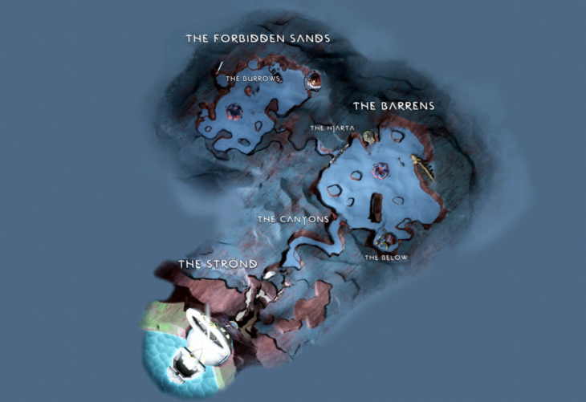
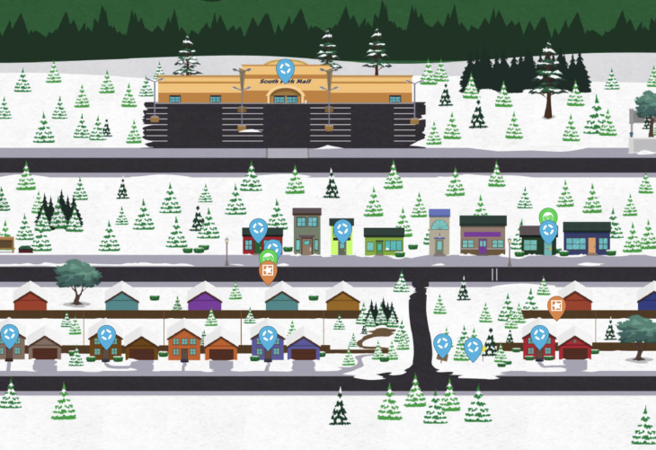

% An Introduction to Spatial Analysis
% Sean Burns, PhD, Associate Professor 
% April 6, 2023

## Prolegomenon: Spatial Analysis and Mapping Techniques in Gaming

Spatial analysis and mapping techniques are used in the
production of video games to create realistic and immersive
game environments.

## God Of War Ragnarök

Source: [Map Genie](https://mapgenie.io/)

## South Park: The Stick of Truth

Source: [Map Genie](https://mapgenie.io/)

## Outline of Spatial Analysis Talk

- Map components
- Spatial memory recall and its importance in daily life
- Spatial analysis techniques and their applications
- Introduction to GIS spatial analysis

## Maps: Key components

The basic components of a map include:

- Title
- Legend
- Scale
- Orientation
- Data Source
- Projection
- Grid

## Maps: Example

Source: [KY Dept. of Transportation](https://transportation.ky.gov/Planning/SPRS%20Maps/Fayette.pdf)

## Map Projections: Cylindrical Projections

<!-- Aids navigation; distorts nearer the poles -->

Source: [Wikipedia: Mercator
Projection](https://en.wikipedia.org/wiki/Mercator_projection)

## Map Projections: Pseudocynlindrical Projections

<!-- Aids visualization; distorts nearer the poles -->

Source: [Wikipedia: Robinson
Projection](https://en.wikipedia.org/wiki/Robinson_projection)

## Map Projections: Conic Projections

Source: [Wikipedia: Lambert Conformal Conic
Projection](https://en.wikipedia.org/wiki/Lambert_conformal_conic_projection)

<!-- used in aviation charts -->

## Map Projections: Azimuthal Projections

Source: [Wikipedia: General Perspective
Projection](https://en.wikipedia.org/wiki/General_Perspective_projection)

<!-- a type of camera view: from a perspective -->

## Spatial Memory Recall

Spatial memory recall refers to the ability to remember and
navigate through a physical space. It involves the brain's
ability to encode, store, and retrieve information about the
spatial layout of our environment.

## Spatial Analysis

Spatial analysis is a set of techniques used to analyze and
understand spatial data.

## Spatial Data

Spatial data refers to any data that has a geographic or
spatial component, such as location or distance.

## Spatial Analysis Techniques

Spatial analysis techniques allow us to explore, visualize,
and analyze this type of data to identify patterns and
relationships that may not be apparent through other forms
of analysis.

## Common Applications

- Geographic Information Systems (GIS)
- Spatial statistics
- Spatial modeling
- Remote sensing
- Spatial data visualization
- Spatial decision-making

## Spatial Analysis Techniques: GIS Demonstration

- GIS software (such as ArcGIS or QGIS)
- Data for a city (such as roads, buildings, and other
  infrastructure)
    - GIS files needed
        - **Vector data layer:** This is the layer that
          contains the features you want to buffer, such as
          roads, buildings, or points of interest. The
          vector data layer should be in a file format that
          is compatible with QGIS, such as Shapefile (.shp),
          GeoJSON (.json), or KML (.kml).
        - **Attribute table:** The attribute table is a
          spreadsheet that contains information about the
          features or events in the vector data layer. It
          may include columns such as feature ID, name,
          size, and location.
- Spatial analysis tools (such as buffer analysis, spatial
  query, or hotspot analysis)

## Definitions:

**Buffer analysis:** Buffer analysis is a spatial analysis
technique used to create a buffer zone or area around a
particular feature or set of features in a geographic
dataset. The buffer zone is typically a defined distance or
area surrounding the feature(s), and is created by measuring
a set distance or area around each feature.

## Definitions (cont.):

**Spatial query:** A spatial query is a type of query used
in geographic information systems (GIS) to select features
or objects in a spatial dataset that meet certain spatial
criteria. Spatial queries can be used to identify features
that intersect, overlap, or are within a certain distance of
other features in the dataset.

## Definitions (cont.):

**Hotspot analysis:** Hotspot analysis is a spatial analysis
technique used to identify areas of a dataset that have a
statistically significant higher or lower frequency of a
particular feature or event than would be expected by
chance. It is used to identify spatial patterns or clusters
of features within a dataset.

## Outline of Spatial Analysis Talk

In this talk, we discussed:

- maps and map components
- spatial memory recall and its importance in daily life
- spatial analysis techniques and their applications
- spatial analysis using GIS spatial analysis
