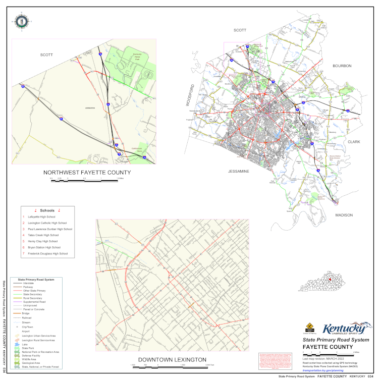
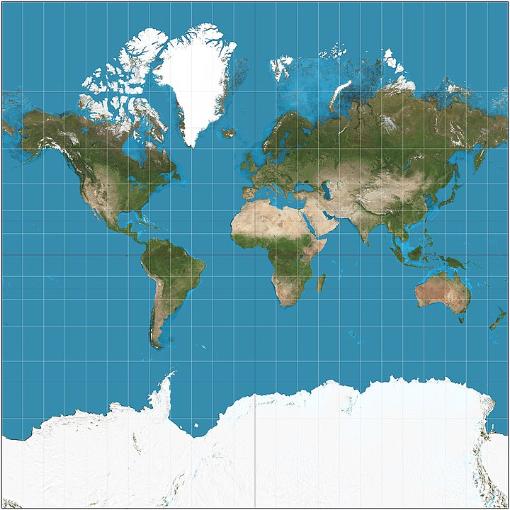
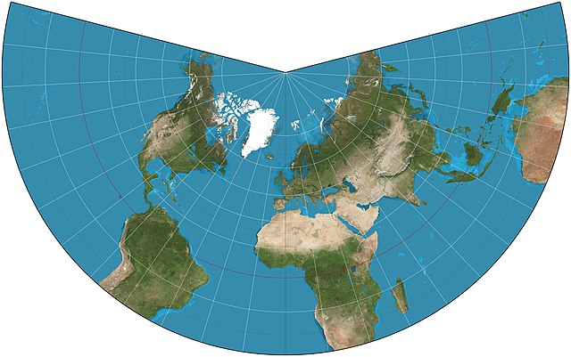
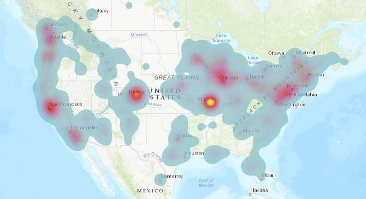

% An Introduction to Spatial Analysis
% Sean Burns, PhD
% November 7, 2023

## Outline of Spatial Analysis Talk

- Spatial analysis research topics
- Map components
- Map projections
- Spatial memory recall
- Spatial analysis: Techniques and applications
- GIS spatial analysis: Demonstration

## Spatial Analysis Research Topic: ex. 1

- **Environmental Monitoring and Management**:
    - Anthropogenic activities such as deforestation can lead to changes in
      temperature, rainfall, and vegetation levels, further degrading the
      Amazon and disrupting the hydrological cycle (Braga et al., 2020).

Silva, A. A., Braga, M., Ferreira, J., Santos, V. J., Alves, S. do C.,
Oliveira, J. C. de, ... Calijuri, M. (2020). Anthropic activities and the Legal
Amazon: Estimative of impacts on forest and regional climate for 2030. *Remote
Sensing Applications: Society and Environment, 18,* 100304.
https://doi.org/10.1016/j.rsase.2020.100304

## Spatial Analysis Research Topic: ex. 2

- **Urban Planning**:
    - GIS-based tools can automate the planning and design process of district
      heating networks (as opposed to within building heating systems), making
      it less complex and time-consuming, especially for large networks. The
      authors found that GIS tools can effectively and efficiently produce
      network layouts (Jebamalai et al., 2019).

Jebamalai, J. M., Marlein, K., Laverge, J., Vandevelde, L., & van den Broek, M.
(2019). *An automated GIS-based planning and design tool for district heating:
Scenarios for a Dutch city.* Energy.
https://doi.org/10.1016/J.ENERGY.2019.06.111

## Spatial Analysis Research Topic: Example Hypotheses

1. **Environmental Monitoring and Management**: 
   - Hypothesis: Deforestation in the Amazon rainforest is correlated with
     increased local temperature anomalies.
   - GIS Application: Use satellite imagery and deforestation data to map
     changes over time and analyze the correlation with temperature data.
2. **Urban Planning and Infrastructure**:
   - Hypothesis: Urban heat islands in major cities contribute to higher energy
     consumption in buildings.
   - GIS Application: Map urban heat islands using remote sensing and assess
     the impact on energy consumption patterns in residential and commercial
     buildings.
3. **Public Health**:
   - Hypothesis: There is a relationship between the proximity to waste
     management sites and the incidence of respiratory diseases in a
     population.
   - GIS Application: Analyze the spatial distribution of waste management
     sites and health data to identify any correlations.
4. **Agriculture and Food Security**:
   - Hypothesis: Crop yields are affected by the distance from water sources in
     semi-arid regions.
   - GIS Application: Map agricultural fields, overlay with water source
     locations, and perform spatial analysis to determine the impact on yields.
5. **Disaster Management and Response**:
   - Hypothesis: Areas with lower socioeconomic status have a slower recovery
     rate after natural disasters.
   - GIS Application: Use socioeconomic data layers and post-disaster recovery
     data to analyze and map the recovery rates.

## Spatial Analysis Research Topic: Example Hypotheses

6. **Transportation and Logistics**:
   - Hypothesis: Traffic congestion in urban areas increases air pollution
     levels and has a negative impact on public health.
   - GIS Application: Map traffic patterns, congestion points, and air quality
     measurements to study the relationship.
7. **Conservation Biology and Ecology**:
   - Hypothesis: The fragmentation of natural habitats leads to a decline in
     biodiversity.
   - GIS Application: Map habitat distributions, fragmentation patterns, and
     species richness to assess the impact of habitat fragmentation.
8. **Climatology and Weather Forecasting**:
   - Hypothesis: Certain land use patterns can influence local weather
     phenomena, like rainfall.
   - GIS Application: Analyze land use data and historical weather patterns to
     explore the relationship.
9. **Archaeology**:
   - Hypothesis: Ancient human settlements were strategically located near
     water sources.
   - GIS Application: Map known archaeological sites and ancient waterways to
     determine the correlation.
10. **Criminology and Law Enforcement**:
    - Hypothesis: There is a spatial correlation between unemployment rates and
      crime rates in urban areas.
    - GIS Application: Overlay crime data with economic data to identify
      patterns and hotspots.

## Maps in GIS

- Maps in GIS serve as a foundational visual representation layer.
- They allow for the integration, analysis, and interpretation of geospatial data.

## Maps: Key components

Maps have key components. These include:

- Title
- Legend
- Scale
- Orientation
- Data Source
- Projection
- Grid

## Maps: Example

Source: [KY Dept. of Transportation](https://transportation.ky.gov/Planning/SPRS%20Maps/Fayette.pdf)

## Map Projections

Since the Earth is **not flat**, maps have to be *distorted*, or **projected**, onto a two dimensional image.

- Map projections are systematic transformations of the earth's three-dimensional
  surface onto a two-dimensional plane (e.g., a computer monitor).
- Each transformation has different properties and uses.
- These properties and uses are designed to preserve certain spatial
  attributes, like:
    - **area**,
    - **shape**,
    - **distance**, and
    - **direction**.

## Common Map Projections

Some common projections include:

- Cylindrical projections
- Pseudocylindrical projections
- Conical projections
- Azimuthal projections

## Map Projections: Cylindrical Projections

- The main advantage of cylindrical projections is that they preserve angles
  and shapes of landmasses near the equator, while a significant disadvantage
  is the distortion of size and shape of regions as they approach the poles.
- Cylindrical projections are primarily used for navigational purposes, as they
  accurately represent directions and angles, making them suitable for marine
  charts and certain types of world maps where true direction is a priority.

## Map Projections: Cylindrical Projections

<!-- Aids navigation; distorts nearer the poles -->

Source: [Wikipedia: Mercator
Projection](https://en.wikipedia.org/wiki/Mercator_projection)

## Map Projections: Pseudocylindrical Projections

- The main advantage of pseudocylindrical projections is that they provide a
  more balanced view of the earth by representing both the equatorial and polar
  regions with less distortion than standard cylindrical projections, while the
  disadvantage is that they do not maintain true scale or area consistently
  across the map.
- Pseudocylindrical projections are commonly used for world maps that aim to
  present a visually pleasing representation of the Earth, balancing the
  distortion of land areas and angles to provide a compromise between the shape
  and scale of global features.

## Map Projections: Pseudocylindrical Projections

<!-- Aids visualization; distorts nearer the poles -->

Source: [Wikipedia: Robinson
Projection](https://en.wikipedia.org/wiki/Robinson_projection)

## Map Projections: Conic Projections

- The main advantage of conic projections is their ability to accurately
  represent the shape and area of landmasses in mid-latitude regions, while a
  significant disadvantage is the distortion of landforms and distances in the
  equatorial and polar regions.
- Conic projections are primarily used for mapping mid-latitude regions such as
  individual countries or smaller continents, where accurate representation of
  areas and distances is important, such as in road atlases and agricultural
  planning.

## Map Projections: Conic Projections

Source: [Wikipedia: Lambert Conformal Conic
Projection](https://en.wikipedia.org/wiki/Lambert_conformal_conic_projection)

<!-- used in aviation charts -->

## Map Projections: Azimuthal Projections

- The main advantage of Azimuthal projections is that they display the Earth's
  surface radially onto a plane and are often used for polar regions, as they
  accurately represent distances and directions from the center point.
- Azimuthal projections are primarily used for mapping polar regions to
  accurately represent distances and directions from a central point, making
  them particularly useful for flight planning, satellite communication, and
  polar research.

## Map Projections: Azimuthal Projections

Source: [Wikipedia: General Perspective
Projection](https://en.wikipedia.org/wiki/General_Perspective_projection)

<!-- a type of camera view: from a perspective -->

## Spatial Memory Recall

Spatial memory recall refers to the ability to remember and
navigate through a physical space. It involves the brain's
ability to encode, store, and retrieve information about the
spatial layout of our environment.

## Spatial Memory Recall: Exercise

Test time!

## Spatial Analysis Techniques: Methods

Spatial analysis techniques allow us to explore, visualize, and analyze spatial
data to identify patterns and relationships that may not be apparent through
other forms of analysis.

- Spatial data visualization
- Spatial statistics
- Spatial modeling
- Spatial decision-making
- Remote sensing

## Spatial Analysis Techniques: Spatial Data

Spatial data refers to any data that has a geographic or
spatial component, such as location or distance.

## Spatial Analysis Techniques: Spatial Data Formats

Some common spatial data formats:

- Shapefiles (.shp): a vector data format used in GIS software
- Keyhole Markup Language (.kml/.kmz): common file format used in applications like Google Earth
- GeoJSON (.geojason): a format used to encode geographic data using JavaScript Object Notation (JSON)
- TIFF/GeoTIFF (.tiff/.tif): A raster graphics image format with georeferencing information embedded
- GPS Exchange Format (.gpx): An XML format for the interchange of GPS data

## Spatial Analysis Techniques: Spatial Data Types

Some common spatial data types:

- Vector data: represents geographic features with points, lines, and polygons. Points represent features like cities or houses, lines represent features like rivers or streets, and polygons represent areas like lakes or city boundaries.
- Raster data: represents geographic features with pixelated images or grids. Each pixel has a value representing information, such as temperature or elevation.
- Attribute data: non-spatial data that describes the properties of spatial features, often stored in tables and linked to spatial data. Examples include demographics, income, gross domestic product, population totals.

## Spatial Analysis Techniques: GIS Software 

- Geographic Information Systems (GIS)
    - QGIS: [https://qgis.org/en/site/](https://qgis.org/en/site/)
    - QGIS Tutorials and Tips: [https://qgis.org/en/site/](https://qgis.org/en/site/)
    - ArcGIS: [https://www.arcgis.com/index.html](https://www.arcgis.com/index.html)
    - GRASS GIS: [https://grass.osgeo.org/](https://grass.osgeo.org/)
    - GeoDa (spatial data science): [https://geodacenter.github.io/](https://geodacenter.github.io/)

## Spatial Analysis Techniques: Buffer Analysis

Buffer analysis is a spatial analysis technique used to
create a buffer zone or area around a particular feature or
set of features in a geographic dataset. The buffer zone is
typically a defined distance or area surrounding the
feature(s), and is created by measuring a set distance or
area around each feature.

## Spatial Analysis Techniques: Buffer Analysis

Source:
[ESRI.com](https://www.esri.com/about/newsroom/arcuser/the-undead-liven-up-the-classroom/)

## Spatial Analysis Techniques: Hotspot Analysis

Hotspot analysis is a spatial analysis technique used to
identify areas of a dataset that have a statistically
significant higher or lower frequency of a particular
feature or event than would be expected by chance. It is
used to identify spatial patterns or clusters of features
within a dataset.

## Spatial Analysis Techniques: Hotspot Analysis

Source:
[OutAlivePodcast](https://www.outalivepodcast.com/the-blog/gis-tool-hot-spot-analysis)

## Spatial Analysis Techniques: Spatial Query

A spatial query is a type of query used in geographic
information systems (GIS) to select features or objects in a
spatial dataset that meet certain spatial criteria. Spatial
queries can be used to identify features that intersect,
overlap, or are within a certain distance of other features
in the dataset.

## Spatial Analysis Techniques: GIS Demonstration

- GIS software (such as ArcGIS or QGIS)
- Data for a city (such as roads, buildings, and other
  infrastructure)
    - GIS files needed
        - **Vector data layer:** This is the layer that
          contains the features you want to buffer, such as
          roads, buildings, or points of interest. The
          vector data layer should be in a file format that
          is compatible with QGIS, such as Shapefile (.shp),
          GeoJSON (.json), or KML (.kml).
        - **Attribute table:** The attribute table is a
          spreadsheet that contains information about the
          features or events in the vector data layer. It
          may include columns such as feature ID, name,
          size, and location.
    - Data: [Natural Earth](https://www.naturalearthdata.com/)
    - Data: [Lexington Geographic Information Services](https://www.lexingtonky.gov/departments/geographic-information-services)
    - Data: [data.gov](https://data.gov)
    - Data: [UKY GIS](https://gishub.uky.edu/pages/data)
    - Data: [TIGER/Line Shapefiles](https://www.census.gov/geographies/mapping-files/time-series/geo/tiger-line-file.html)
- Spatial analysis techniques (such as buffer analysis, spatial
  query, or hotspot analysis)

## Educational Paths

Cartography & GIS Courses at UK are provided by Geography
department in the College of Arts and Sciences.

[Cartography & GIS Courses](https://geography.as.uky.edu/cartlab-courses)

## Outline of Spatial Analysis Talk

In this talk, we discussed:

- Spatial analysis research topics
- Maps components
- Map projects
- Spatial memory recall
- Spatial analysis: Techniques and their applications
- GIS spatial analysis: Demonstration
