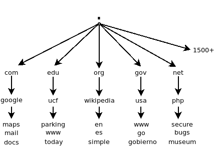

# Searching Google Well

## Introduction

There are three big things to consider when advancing your skills with search
on the web:

- Web documents
- Web file system
- Web query construction

## The web is for storing and retrieving documents

When we use Google or another search engine to search, we are often looking for
text or documents containing text or matching descriptions. This has some
implications:

- *Text* has primacy.
- Our queries are matched against the text that appears in documents on the
  web.
- The better our queries match the documents, the better (or more precise) our
  search results will be.
- The challenge with search is that we do not always know what text a document
  contains even if that document covers the topic or concept that we think is
  relevant.
- For example, consider *synonyms*. If I search for `the sun`, could I also
  mean `solar`, `star`, `light`, `radiation`?
- What if a document only uses terms like `solar`, `star`, `light`, and
  `radiation`? Might it still be useful if I was interested in documents (i.e.,
  web pages) about `the sun`?
- Other *wordy* issues include things like *homonyms*: by `bark`, do I mean the
  bark on a tree or the word we use to signal the sound a dog makes?
- Phrases are also important, with respect to term adjacency and word order. If
  I search for `forest fire`, Google, and other search engines, is more likely
  to return results where those two terms appear next to each other. This will
  mean that documents that contain text about someone having a `camp fire in a
  forest` will be less likely to appear at the top of my results than a
  document that contains the phrase `forest fire`.

## The web is well organized

The web is strongly organized, even though it may not appear so. We can take
good advantage of that when we search by narrowing our searches to just parts
of the web.

- The web is organized like a tree. This tree like structure originally
  contained just a few main branches, such as: .com, .edu, .org, .gov, and
  .net, but now contains over 1500 of these. 
- Each of the big branches (top level domains) contains smaller branches
  (second level domains), such as google.com, ucf.edu, wikipedia.org, usa.gov,
  and php.net.
- Those smaller branches (second level domains) contain even smaller branches
  (third level domains: maps.google.com, parking.ucf.edu, en.wikipedia.org,
  www.usa.gov, and secure.php.net).
- We can take advantage of this organization by limiting (or focusing) queries
  to results within smaller sections of the web.
- In Google, this would entail using what is called the `site:` operator in
  combination with the query we have constructed. For example, let's say I do a
  regular search for the term `flu` and I notice that most of the results that
  I'm interested in are from `.gov` domains and most of the results I'm less
  interested in are from `.com` domains. To address that, I add the site
  operator to my query: `flu site:gov`. 
- Then perhaps, let's say that I find these results too general still. We can
  focus the result on just a smaller branch of the tree. E.g.: `flu
  site:floridahealth.gov`.
- If we take a close look, we can see that `floridahealth.gov` is further
  subdivided by Florida counties. E.g.: `flu site:orange.floridahealth.gov`.



## Constructing queries for precise results

Our queries are important and there are all sorts of tips and tricks we can
apply to revise and make them more precise.

- **Use quotes:** In our last search, Google provided us with snippets of text
  that highlighted where the term **flu** appears in the web pages that are
  retrieved. For example, we see terms like: *flu activity*, *flu season*, and
  *flu shot*. This is important information because we can use it to revise our
  search. Let's say that what I'm really interested in are web pages that
  contain info about *flu shots* and less about pages that contain information
  on *flu activity* or *flu season*. If that's the case, then I can add the
  additional term to my query and also enclose the whole term in quotation
  marks. That will force Google to rank pages with the literal term *"flu
  shot"* much higher than those other pages, or exclude those other pages
  altogether. So our query will now look like this:
    - `"flu shot" site:orange.floridahealth.gov`.
- And, if I'm really interested only in recent pages, I can click on the
  **Tools** button and select Past hour, Past 24 hours, Past week, or etc.
- **Exclude results with the minus sign:** Let's take a look at our flu shot
  search. Instead of enclosing `"flu shot"` in quotes to return only pages with
  that phrase, I could exclude the other terms of less interest (i.e.,
  `activity` and `season`) by excluding them with a minus sign. This is how our
  search would look:

```
flu shot -season -activity site:orange.floridahealth.gov
```

I can also exclude specific sites or specific domains:

```
flu shot -site:com
flu shot -site:webmd.com
```

- **Term order matters**:
    - results will be different depending on order. Google has gotten good over
      the years about natural language, and so the suggestion is to use natural
      language in your query, such that **flu shot** would be better than
      **shot flu**.
    - for other types of term pairs, results will become increasingly different
      as you page through results. E.g., consider: search 1) `google bing` ;
      search 2) `bing google`.
    - In addition to the minus sign above, we can also use `OR` to tell Google
      to return pages with either of the terms or both of the terms. Consider:
      search 1) `"google" OR "bing"` ; search 2) `"bing" OR "google"`

## Conclusion

- documents on the web
  - consider the text
- web organization
  - take advantage of the how the web is structured with *site* searches
- query construction
  - use quotes
  - exclude terms with the minus sign
  - term order matters
  - use OR to select alternate terms
- if you forget anything, use advanced search:
  [https://www.google.com/advanced_search](https://www.google.com/advanced_search)

## P.S.

Final tip: You can get very advanced:

```
trade ("surplus" OR "deficit") (site:whitehouse.gov OR site:congress.gov)
```

Or, limit to specific filetypes:

```
trade ("surplus" OR "deficit") (site:whitehouse.gov OR site:congress.gov) filteype:pdf
```

Thanks!

- Sean Burns, Ph.D.
- Assistant Professor
- School of Information Science
- University of Kentucky
- sean.burns@uky.edu
- Date: Tue 04 Dec 2018 
